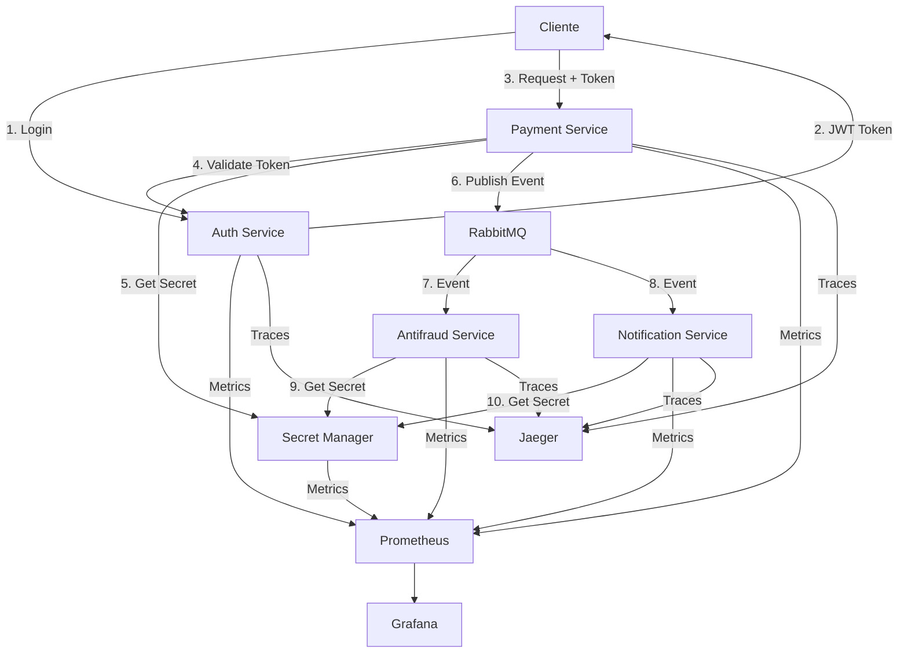

# Arquitetura — Segurança Aplicada e Governança

## Diagrama de Arquitetura



---

## Fluxo de Autenticação

### 1. Login

```
Cliente → Auth Service
  POST /auth/login
  { username, password }
  
Auth Service → Cliente
  { access_token, expires_in, scope }
```

### 2. Requisição Autenticada

```
Cliente → Payment Service
  POST /payments
  Authorization: Bearer <token>
  { accountId, amount, currency }
  
Payment Service → Auth Service
  POST /auth/validate
  { token }
  
Auth Service → Payment Service
  { valid: true, claims: {...} }
  
Payment Service → Cliente
  { paymentId, status }
```

---

## Fluxo de Autorização

### Verificação de Scopes

```
1. Token validado (autenticação OK)
2. Extrair claims do token
3. Verificar se scope necessário está presente
4. Se sim: permitir
5. Se não: retornar 403 Forbidden
```

### Exemplo

```go
// Token tem scopes: ["payments:read", "payments:write"]
// Requisição precisa de: "payments:write"
// Resultado: ✅ Permitido

// Token tem scopes: ["payments:read"]
// Requisição precisa de: "payments:write"
// Resultado: ❌ Forbidden
```

---

## Service-to-Service Communication

### Fluxo

```
1. Payment Service precisa acessar Secret Manager
2. Payment Service obtém service token do Auth Service
3. Payment Service usa service token para acessar Secret Manager
4. Secret Manager valida service token
5. Secret Manager retorna segredo (mascarado em logs)
```

### Segurança

- Cada serviço tem token próprio
- Tokens têm scopes limitados
- Tokens são validados em cada requisição
- Logs nunca expõem tokens completos

---

## Proteção de Dados

### Dados em Trânsito

```
Cliente → Payment Service
  HTTPS (TLS) - em produção
  Dados sensíveis mascarados em logs
```

### Dados em Repouso

```
Payment Request
  ↓
Criptografia (AES-256)
  ↓
Armazenamento (simulado)
  ↓
Descriptografia quando necessário
```

### Mascaramento em Logs

```
CPF: 12345678901
  → Log: ***.***.***-01

Cartão: 4111111111111111
  → Log: ****-****-****-1111

Token: eyJhbGciOiJIUzI1NiIsInR5cCI6IkpXVCJ9...
  → Log: eyJhbGciOi...JIUzI1NiIsInR5cCI6IkpXVCJ9...
```

---

## Secret Management Flow

### Obter Segredo

```
1. Service precisa de segredo
2. Service obtém service token
3. Service faz GET /secrets/:key com token
4. Secret Manager valida token
5. Secret Manager retorna segredo
6. Auditoria registra acesso
```

### Rotacionar Segredo

```
1. Service ou admin solicita rotação
2. Secret Manager gera novo valor
3. Incrementa versão
4. Mantém histórico (opcional)
5. Auditoria registra rotação
```

---

## Componentes

### Auth Service

- **Responsabilidade**: Autenticação e autorização
- **Endpoints**:
  - `POST /auth/login`: Login e obter token
  - `POST /auth/validate`: Validar token
  - `POST /auth/service-token`: Obter token service-to-service
- **Segurança**: JWT com HS256, expiração configurável

### Payment Service

- **Responsabilidade**: Processar pagamentos
- **Segurança**: 
  - Autenticação obrigatória
  - Autorização por scopes
  - Criptografia de dados sensíveis
  - Mascaramento em logs

### Secret Manager

- **Responsabilidade**: Gerenciar segredos
- **Funcionalidades**:
  - Armazenar segredos
  - Rotação automática
  - Auditoria de acesso
- **Segurança**: Service-to-service authentication

### Antifraud Service

- **Responsabilidade**: Detectar fraudes
- **Segurança**: Logs seguros (sem dados sensíveis)

### Notification Service

- **Responsabilidade**: Enviar notificações
- **Segurança**: Logs seguros (sem dados sensíveis)

---

## Observabilidade Segura

### Métricas

- **Auth**: `auth_attempts_total`, `auth_failures_total`, `auth_success_total`
- **Authorization**: `authorization_failures_total`
- **Secrets**: `secret_access_total`, `secret_rotations_total`
- **Payments**: `payments_processed_total` (sem dados sensíveis)

### Logs

- **Estruturados**: JSON
- **Mascarados**: Dados sensíveis nunca completos
- **Correlation ID**: Rastreamento de requisições

### Traces

- **Distribuídos**: Jaeger
- **Sem dados sensíveis**: Apenas IDs e metadados
- **Correlation**: Trace ID propagado

---

## Princípios de Segurança

### Zero Trust

- Nenhuma comunicação é confiável por padrão
- Toda requisição precisa de autenticação
- Service-to-service também autenticado

### Menor Privilégio

- Scopes mínimos necessários
- Roles específicos
- Segredos com escopo limitado

### Defesa em Profundidade

- Autenticação
- Autorização
- Criptografia
- Mascaramento
- Auditoria

### Segurança por Design

- Não é "depois"
- Parte do design desde o início
- Padrões e golden paths

---

## Fluxo Completo: Criar Pagamento

```
1. Cliente faz login → Auth Service
2. Cliente recebe JWT token
3. Cliente envia requisição com token → Payment Service
4. Payment Service valida token → Auth Service
5. Payment Service verifica scopes
6. Payment Service criptografa dados sensíveis
7. Payment Service armazena (simulado)
8. Payment Service publica evento → RabbitMQ
9. Payment Service retorna resposta (sem dados sensíveis)
10. Antifraud Service processa evento
11. Notification Service processa evento
12. Logs registram (dados mascarados)
13. Métricas atualizadas
14. Traces enviados (sem dados sensíveis)
```

---

## Decisões Arquiteturais

### Por que JWT?

- Stateless: não precisa de sessão no servidor
- Escalável: funciona em múltiplos serviços
- Padrão: amplamente suportado

### Por que Secret Manager?

- Centralizado: um lugar para todos os segredos
- Rotação: fácil rotacionar segredos
- Auditoria: rastreamento de acesso

### Por que Mascaramento?

- Logs são compartilhados
- Compliance (LGPD, PCI DSS)
- Reduz risco de vazamento

### Por que Service Tokens?

- Identidade de serviço
- Scopes limitados
- Rastreamento de acesso

---

## Melhorias Futuras

### Curto Prazo

- [ ] Refresh tokens
- [ ] Rate limiting por usuário
- [ ] MFA (Multi-Factor Authentication)

### Médio Prazo

- [ ] mTLS real (não simulado)
- [ ] Key rotation automática
- [ ] Audit log centralizado

### Longo Prazo

- [ ] OAuth2 completo
- [ ] RBAC (Role-Based Access Control) avançado
- [ ] Compliance automation

---

**Arquitetura segura por design. Governança para escalar.**
